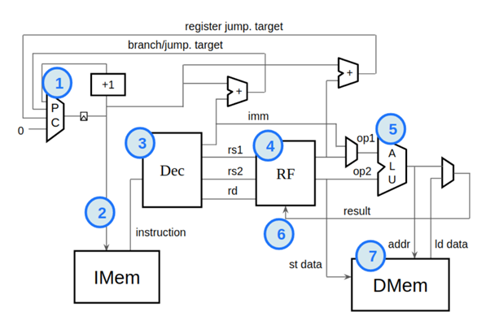
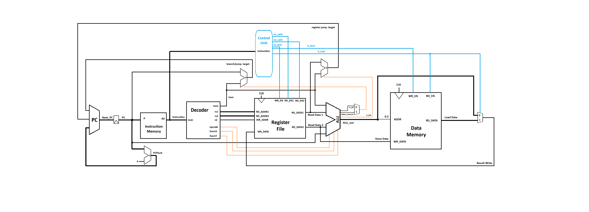

# Building a RISC-V CPU Core

## Course Description

This free mini-workshop, offered by by [Steve Hoover](https://www.linkedin.com/in/steve-hoover-a44b607/) of [Redwood EDA, LLC](https://redwoodeda.com), [Linux Foundation](https://www.linuxfoundation.org/), and [RISC-V International](https://riscv.org) is a crash course in digital logic design and basic CPU microarchitecture. Using the Makerchip online integrated development environment (IDE), you’ll implement everything from logic gates to a simple, but complete, RISC-V CPU core. You’ll be amazed by what you can do using freely-available online tools for open-source development. You’ll walk away with fundamental skills for a career in logic design, and you’ll position yourself on the forefront by learning to use the emerging Transaction-Level Verilog language extension (even if you don’t already know Verilog).

## RISC-V Block Diagram

## RISC-V Visualization

Here's a pre-built logic diagram of the final CPU. Ctrl-click here to [explore in its own tab](https://raw.githubusercontent.com/stevehoover/LF-Building-a-RISC-V-CPU-Core/main/lib/riscv.svg).

## RISC-V Datapath

Here's the datapath designed from the block diagram with a few extend components to compatible with Verilog code conversion and Altera DE2 Kit testing.
